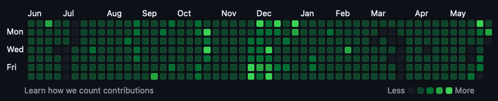

# Github Gardener
Looking to make your Github contributions to look like a field of green pasture?

You can go from this:

To this! ✅💚🍀🐸🍏✳️🟩🌲

With just a single command, you can instantly turn your github contributions to look like a lush, green forest.

## Note 
🚨 This script is only written out of pure entertainment and fun. I do not support any form of cheating and this is by all means a form of cheat. *However* if there are people out there who wants to judge a person's skill and worthiness through github contributions, I guess then they deserve to see a very "active" github contribution table.

## Usage
**Prerequisites:** You will need to create a repository via the github UI and take note of the repository name (you will need it to pass the script in the option `--repo_name` or `-r`). 
Apparently it used to be able to create a github repository via the command line as long as you know your github username. However recently github have implemented a personal access token authentication workflow and it forces users to create repository via the github UI only.

### What it does?
Running this script will create a dummy repo on the same level/directory of where you clone the repo to.

It will then create a text file in the dummy repo, randomly generate 300 dates and for each date append a text to the file and create a past commit out of it. It will then push up to remote.

### Steps
1. Create a repository in your github account. Take note of your **repository name** and **github username**
2. Clone this repo and `cd` into it
3. Run `bundle install`
4. Run `ruby gardener.rb -r {your_repo_name} -u {your_github_username}`
5. Go to your github account overview and see your contributions be full of green.